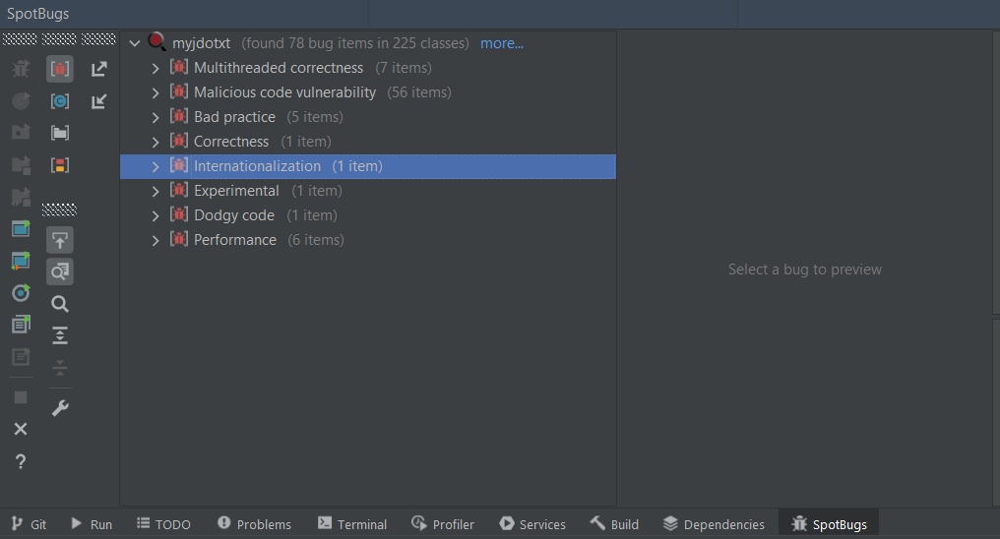
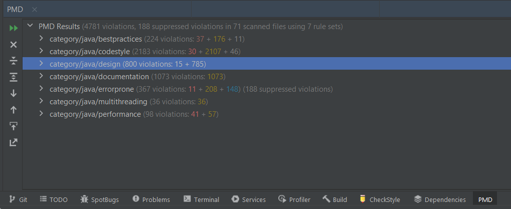
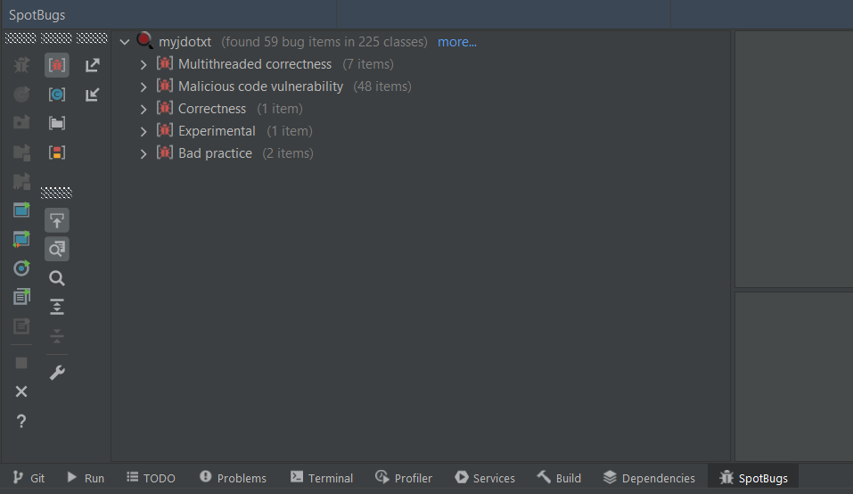
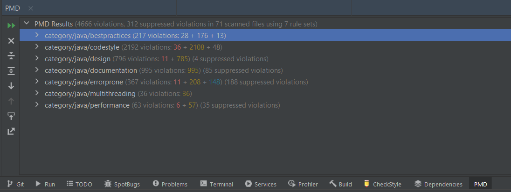

# Report - Assignment 1

> **Anastasiia Dunaeva** - up202202453


## Brief description of your project

- The _jdotxt_ project is a desktop application which helps to organize todo lists. You can create lists of task in the app, name them, set due date, set priority, hide, mark tasks as done and delete them. List of tasks can be sorted by these parameters. The application can automatically create a .txt file with todo tasks and done tasks with its human-readable notation. Also user can set contexts and projects with tasks what helps to separate lists of tasks.

- Source code of the project contains two folders as usual: _java_ and _tests_. _java_ contains two folders: _chschmid.jdotxt_ and _todotxt.todotxttouch_.
  - _chschmid.jdotxt_ is responsible for graphical user interface (_gui_ folder) and provide supporting controllers, listeners and handlers for it (_util_ folder). Runnable java file _Jdotxt_ is located here.
  - _todotxt.todotxttouch_ is responsible for model. It contains model of task, all filters which can be applied for task, sorters and parsers from txt format (_task_ folder). Also it provides auxiliary data types and methods for them (_util_ folder).


## Brief description of what static testing is and why do you think it is import and relevant
- Static testing is a software testing technique that does not require program execution. It checks the program and related documents before launching (during building) for errors. It can look for code style problems, issues that can potentially lead to runtime errors, bad practices, problems that can confuse the developer or the user, subtle places where an error can occur in the case of multiple threads, potentially vulnerable places for malicious code.
- Usually in companies it is customary to do a code review for each new implemented feature. In the company where I worked, it was customary to send the written code for a review to two developers, one of whom should be a senior. This takes a lot of time to search for all potential errors, describe them in the comments, re-check, besides, when skimming the code, even the senior may not notice some potential errors. It would be much more efficient to entrust the search for common bug patterns to a special tool, which would reduce testing time, company costs and improve the quality of the code. In addition, such tools usually have the ability to activate/deactivate some bug patterns that are usual/unusual for a particular project.

## Brief description of the static testing tool used in this assignment and how was it configured
- I used SpotBugs and PMD tools for static testing as Maven plugins. 
- SpotBugs checks code for more than 400 bug patterns. Some of them are disabled by default, e.g. DumbMethods ("this detector looks for calls to pointless methods, such as the no-argument String constructor" - description from SpotBugs). Below in the report I described categories of SpotBugs bug patterns more detailed. After scanning I disabled performance bug pattern related with non-static inner class because it is not actual for this project (described bellow).
- PMD finds bugs of following categories: best practices, codestyle, design, documentation, error-prone, multithreading, performance.  For some classes I suppressed some warnings which are not actual for project or specific class. For example suppressed PMD.AvoidUsingShortType for every class which occur it because it is deprecated.
## Brief description of the report produced by the static testing tool
- SpotBugs

<br>
This report shows problems of following types: multithreaded correction (places where the program can occur errors because of incorrect threads relation), malicious code vulnerability (potentially vulnerable code where data can be stolen or changed), bad practice (not recommended practices), correctness (mistakes in code which probably weren't intended by developer), internationalization (potential problems with languages/encoding), experimental (not checked bug patterns), dodgy code (anomalous) and performance (places where we program can take more time or storage then it needs).
</br>

- PMD

<br>
The report shows problems by following rule sets: best practices (check if code follows best practices), codestyle (naming and other conventions), design (recommendations for design), documentation (java docs recommendations), error-prone (statements which can occur errors in runtime), multithreading (issues with code which can be used my multiple threads), performance (code which can be optimized).
</br>

## Brief description of the 5 randomly selected bugs and how those 5 bugs were addressed/fixed (SpotBugs)


- Field isn't final but should be
    <br>
    Static and public, but not final field potentially can be changed by malicious code, or just accidentally by developer, what is dangerous. Here this field plays role of constant, so it is not justifiably to have not final public static variable. There are an example and how it was changed.
    </br>
     ```java
       // e.g. com.chschmid.jdotxt.gui.JdotxtGUI
     public static int MIN_WIDTH = 640;
     public static int MIN_HEIGHT = 480;
     ```
    ```java
     public static final int MIN_WIDTH = 640;
     public static final int MIN_HEIGHT = 480;
    ```
- Method ignores exceptional return value
<br>
Method returns a result which isn't checked, but it can show display some unexpected behaviour which user or developer should now. For example _File.mkdir()_ returned boolean value if directory was created and false if not (e.g while writing tests it could be useful)
</br>
<br>
In this case we can get returned value and check it, and provide an information to logs about directory, if it was created or not.
</br>

  ```java
     // e.g. com.chschmid.jdotxt.Jdotxt
     todoFileDir.mkdirs();
  ```
  ```java
     if (todoFileDir.mkdirs()) {
            System.out.println("Directory was created");
           } else {
          System.out.println("Directory wasn't created");
        }
  ```
  
- Should be a static inner class
<br>
Inner classes which don't have a reference to the object which created it is bad for performance, because instances will take a lot of memory and can make class-creator life more than needed. But in our project the instance of class creator is created once, because it is user interface, and it means that we will not face with this problem. Because of it I disabled this flag.
</br>

  ```java
    // e.g.  com.chschmid.jdotxt.gui.JdotxtGUI.MyMouseWheelListener
    public class MyMouseWheelListener implements MouseWheelListener {
        // code of class
    } 
  ```

- Switch statement found where default case is missing
<br>
Switch-case statement doesn't contain default case and doesn't cover all possible inputs. It can occur logical errors. In the example from project switch depends on short variable and cover only to 2 values. Developer can accidentally set another value and get error, it's better to provide an information to logs about wrong input.
</br>

  ```java
     // e.g.   com.chschmid.jdotxt.gui.JdotxtWelcomeDialog
     switch(purpose) {
        case P_WELCOME:
            setTitle(JdotxtGUI.lang.getWord("Welcome"));
            break;
        case P_PATH_NOT_FOUND:
               setTitle(JdotxtGUI.lang.getWord("Text_file_not_found"));
              break;
     }
  ```
  ```java
     switch(purpose) {
        case P_WELCOME:
            setTitle(JdotxtGUI.lang.getWord("Welcome"));
            break;
        case P_PATH_NOT_FOUND:
               setTitle(JdotxtGUI.lang.getWord("Text_file_not_found"));
              break;
        default:
              System.out.println("Purpose is not defind");
     }
  ```
- Reliance on default encoding
<br>
Performing byte array to String without specifying encoding can occur errors on different platform. In this case we can provide an encoding to String constructor. 
</br>

  ```java
     // e.g.   com.todotxt.todotxttouch.util.Util
     sb.append(new String(buffer, 0, c));
  ```
  ```java
     sb.append(new String(buffer, 0, c, StandardCharsets.UTF_8));
  ```


## Brief description of the 5 randomly selected bugs and how those 5 bugs were addressed/fixed (PMD)

- SystemPrintLn
    <br>
    System.println is using for debugging purpose and it is not really good to debug this way. It's better to use logging for this purpose, so it can be enabled and disable when it is needed.
    </br>
     ```java
       // e.g. com.todotxt.todotxttouch.util.TaskIo
       if (!file.exists()) {
			    System.out.println(file.getAbsolutePath() + " does not exist!");
       }
     ```
    ```java
      private static final Logger logger = LogManager.getLogger(TaskIo.class);
      // some code
      if (!file.exists()) {
			    logger.info(file.getAbsolutePath() + " does not exist!");
		    }
    ```
- AvoidThrowingNullPointerException
  <br>
  PMD advises to avoid throwing NullPointer exception manually because it is confusing and developer can think that exception is thrown by java, not manually. I think that in this case of manual Comparator it can be thrown to keep general logic, because it is thrown in Comparators by system. This bug was also suppressed.

  ```java
     // e.g. com.todotxt.todotxttouch.task.sorter.Sorters
     @SuppressWarnings("PMD.AvoidThrowingNullPointerException")
     public enum Sorters {
        // class code
     }
  ```

- CommentRequired
  <br>
  This warning tells where javadoc is absent. In case of this project it is not neede everywhere, e.g. in runnable main class Jdotxt which concept is obvious. Because of that such warnings were suppressed in places where it is not needed. 
  </br>

  ```java
     // e.g.  com.chschmid.jdotxt.Jdotxt
    @SuppressWarnings("PMD.CommentRequired")
    public class Jdotxt {
        //class code
    }
  ```

- AvoidUsingShortType
  <br>
  Old rationale of this bug type is that using shorter type for numbers doesn't optimize calculations, because firstly java convert value to int. But this type of bug is deprecated so i suppressed it.
  </br>
  

  ```java
     // e.g.   com.chschmid.jdotxt.gui.JdotxtWelcomeDialog
    @SuppressWarnings("PMD.AvoidUsingShortType")
    public interface TaskListener {
        // class code
    }
  ```
- LocalVariableNamingConvention
  <br>
  This bug pattern reports about errors with naming convention, for Java it is Camel case. Because the project is open source some developers used another cases, in this example it is Snake case. I changed this variables name to align with other project code name convention. 
  </br>

  ```java
     // e.g.   com.todotxt.todotxttouch.task.ThresholdDateParserTest
        Date due_expected = FORMAT.parse("2018-01-30");
        Date thr_expected = FORMAT.parse("2018-01-29");
  ```
  ```java
        Date dueExpected = FORMAT.parse("2018-01-30");
        Date thrExpected = FORMAT.parse("2018-01-29");
  ```


