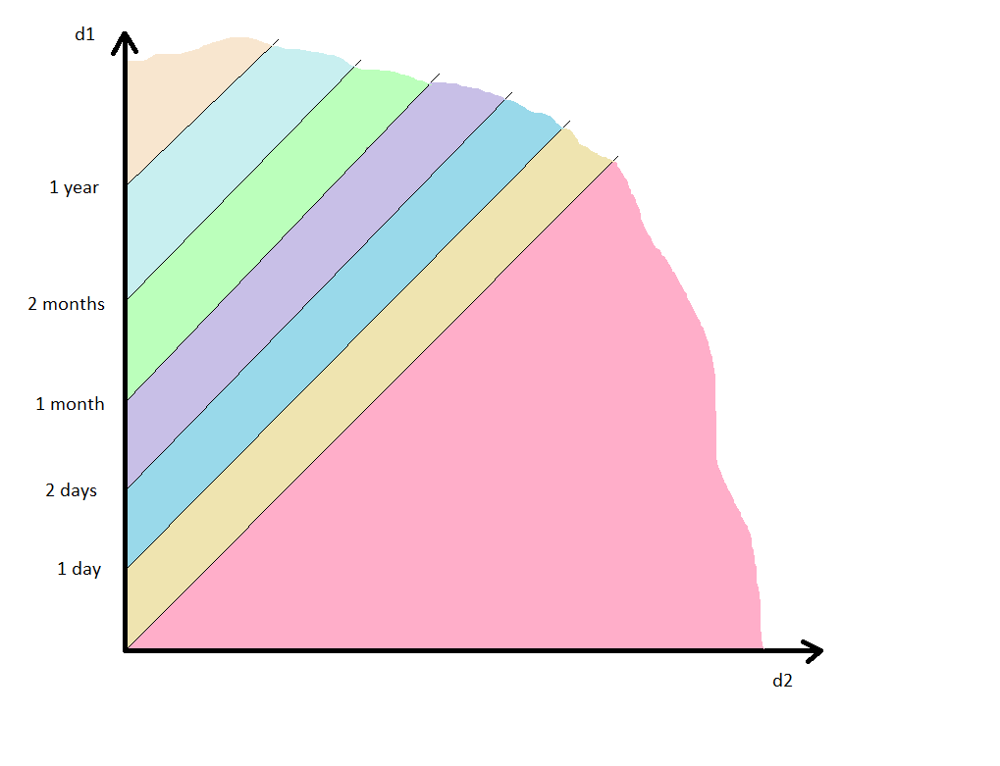

# Report - Assignment 2

> **Anastasiia Dunaeva** - up202202453

## Which functions have you selected for testing and why

Following functions were selected form package _com.todotxt.todotxttouch.util_. They were selected becaise they are from different class, have different amount and types of arguments and different types of returned values. 

  ```java
    public static final int calculate(int priorCursorPosition, String priorValue, String newValue);

    public static String getRelativeDate(Calendar d1, Calendar d2);

    public static String fileName(String path);

    public static boolean isBlank(String s);

    public static String insertPadded(String s, int insertAt, String stringToInsert);
  ```

## What is the purpose of each function

- _public static final int calculate(int priorCursorPosition, String priorValue, String newValue)_
    - Calculates new cursor position based on previous cursor position, previous value of string and new value of string. If priorValue is null than the calculated position will be the position just after the string. If the newValue is null than the position will be 0. Otherwise, it's calculated based on length difference between priorValue and newValue. If calculated position is less than 0, function returns 0. If calculated position is more than length of new string value, function returns 0. 

- _public static String getRelativeDate(Calendar d1, Calendar d2)_
  - Function returns a relative date between two dates d1 and d2, how much date d1 is later than d2. Returned value is a string which represents this difference. It can be "today", if d1 is less than one day later than d2, "1 day ago" if d1 is more than 1 day later than d2, "N days ago" if d1 is more than 2 days later than d2, "1 month ago" if d1 is more than 1 month later than d2, "N months ago" if d1 is more than 2 months later than d2. It returns d2 in case d1 is earlier than d2 or if d1 is more than year later than d2.

- _public static String fileName(String path)_
  - Function extracts file name from the file path. In case of blank string it returns an empty string, in case the path ends with "/" function removes it and returns last substring without "/" in the path, in case the path doesn't end with "/" function just returns last substring without "/" in the path. 

- _public static boolean isBlank(String s)_
    - Checks if provided string is null, empty or consists of spaces (blank).Return true if yes, and false otherwise.

- _public static String insertPadded(String s, int insertAt, String stringToInsert)_
  - Inserts a stringToInsert into string s to position insertAt padding it with spaces. In case of null or empty initial string s returns stringToInsert. In case of negative insertAt index throws IndexOutOfBoundsException. In case of the insertion point has a space on either end and does not add extra spaces.

## Step-by-step of the ‘Category-Partition’ algorithm for each function
- _public static final int calculate(int priorCursorPosition, String priorValue, String newValue)_
  - priorCursorPosition can be any integer value (negative value is not correct special case, but it is handled by function)
  - priorValue, newValue are any strings or null (null values are not correct special cases, but they are handled by function) 
  - Constraint: we can create only one test where newValue is null, because other values don't important in this case
  - Constraint: we can create only one test where priorValue is null, because other values don't important in this case (put newValue shouldn't be null in this case)
  - Partitions:
    1. priorValue is null
    2. newValue is null, priorValue is not null
    3. new cursor position remains within the boundaries of the line (new position is more than 0 and less than newValue length)
    4. newValue length less than priorValue length, cursor goes beyond the border on the left
    5. newValue length more than priorValue length, cursor goes beyond the border on the right
- _public static String getRelativeDate(Calendar d1, Calendar d2)_
  - d1 and d2 can be any Calendar, not null
  - Dates themselves are not important, only difference between dates is important, that is why cases will split by difference between dates
  - Partitions:
    1. d2 is later then d1
    2. d1 is less than one day later than d2, d2 is earlier than d1
    3. d1 is less than two days and more than one day later than d2
    4. d1 is less than one month and more than two days later than d2
    5. d1 is less than two months and more than one month later than d2
    6. d1 is less than one year and more than two months later than d2
    7. d1 is more than one year later than d2



- _public static String fileName(String path)_
  - path can be any string, including null
  - Constraint: we can create only one test where path is blank (null, empty string and string only with spaces) for testing corner case
  - Partitions:
    1. path is blank
    2. path is not blank and ends with "/"
    3. path is not blank and doesn't end with "/"

- _public static boolean isBlank(String s)_
  - s can be any string, including null
  - Partitions:
    1. s is null
    2. s is empty
    3. s consists only of spaces
    4. s is not empty and consists not only of spaces

- _public static String insertPadded(String s, int insertAt, String stringToInsert)_
  - s can be any string, but not null
  - insertAt can be any integer (negative value is not correct special case, but it is handled by function)
  - stringToInsert can be any string or null (null or empty values are not correct special cases, but they are handled by function)
  - Depending on the presence of spaces in line s, additional spaces will or will not be added
  - Constraint: case with empty or null stringToInsert can be checked by one case as a corner case, other parameters values are not important in this case
  - Constraint: case with negative insertAt can be checked by one case as a corner case, other parameters values are not important in this case (stringToInsert shouldn't be null)
  - Partitions:
    1. Empty stringToInsert
    2. insertAt is negative
    3. insertAt in the middle of string, there isn't space on insertAt index in s
    4. insertAt in the middle of string, there is a space on insertAt index in s
    5. insertAt in the bound of string, there isn't space on insertAt index in s
    6. insertAt in the bound of string, there is a space on insertAt index in s

## Brief description of the unit tests generated for each category

- com.todotxt.todotxttouch.util.CursorPositionCalculatorTest

| function  | partition | unit test                          | parameters values                                                    | expected value |
|-----------|-----------|------------------------------------|----------------------------------------------------------------------|----------------|
| calculate | a         | testCalculatePriorValueNull        | priorCursorPosition = 1, priorValue = null, newValue = "test"        | 4              |
| calculate | b         | testCalculateNewValueNull          | priorCursorPosition = 1, priorValue = "", newValue = null            | 0              |
| calculate | c         | testCalculateCorrect               | priorCursorPosition = 1, priorValue = "test", newValue = "test test" | 6              |
| calculate | d         | testCalculateNewStringShorter      | priorCursorPosition = 1, priorValue = "test test", newValue = "test" | 0              |
| calculate | e         | testCalculateCursorLongerNewString | priorCursorPosition = 5, priorValue = "test", newValue = "test test" | 9              |

- com.todotxt.todotxttouch.util.RelativeDateTest

| function        | partition | unit test                | parameters values                             | expected value |
|-----------------|-----------|--------------------------|-----------------------------------------------|----------------|
| getRelativeDate | a         | testRelativeDateD2Later  | d1 = "2015-01-04", d2 = "2015-01-05"          | "2015-01-05"   |
| getRelativeDate | b         | testRelativeDateToday    | d1 = "2015-01-05 22:00:00", d2 = "2015-01-05" | "today"        |
| getRelativeDate | c         | testRelativeDate1Day     | d1 = "2015-01-06 22:00:00", d2 = "2015-01-05" | "1 day ago"    |
| getRelativeDate | d         | testRelativeDateNDays    | d1 = "2015-01-20", d2 = "2015-01-05"          | "15 days ago"  |
| getRelativeDate | e         | testRelativeDate1Month   | d1 = "2015-02-20", d2 = "2015-01-05"          | "1 month ago"  |
| getRelativeDate | f         | testRelativeDateNMonths  | d1 = "2015-07-05", d2 = "2015-01-05"          | "5 months ago" |
| getRelativeDate | g         | testRelativeDateMoreYear | d1 = "2017-01-05", d2 = "2015-01-05"          | "2015-01-05"   |

- com.todotxt.todotxttouch.util.PathTest

| function | partition | unit test             | parameters values     | expected value |
|----------|-----------|-----------------------|-----------------------|----------------|
| fileName | a         | testFileNameBlank     | path = ""             | ""             |
| fileName | b         | testFileName          | path = "test1/test2"  | "test2"        |
| fileName | c         | testFileNameWithSlash | path = "test1/test2/" | "test2"        |

- com.todotxt.todotxttouch.util.StringsTest

| function | partition | unit test                  | parameters values | expected value |
|----------|-----------|----------------------------|-------------------|----------------|
| isBlank  | a         | testIsBlankCaseNull        | s = null          | true           |
| isBlank  | b         | testIsBlankCaseEmpty       | s = ""            | true           |
| isBlank  | c         | testIsBlackCaseWhitespaces | s = "    "        | true           |
| isBlank  | d         | testIsBlankNotEmptyString  | s = "test"        | false          |

- com.todotxt.todotxttouch.util.StringsTest

| function     | partition | unit test                                  | parameters values                                  | expected value            |
|--------------|-----------|--------------------------------------------|----------------------------------------------------|---------------------------|
| insertPadded | a         | testInsertPaddedInsertedStringEmpty        | s = "test", insertAt = 1, stringToInsert = ""      | "test"                    |
| insertPadded | b         | testInsertPaddedInsertIndexNegative        | s = "test", insertAt = -1, stringToInsert = "test" | IndexOutOfBoundsException |
| insertPadded | c         | testInsertPaddedInsertWithoutSpaces        | s = "test", insertAt = 1, stringToInsert = "test"  | "t test est"              |
| insertPadded | d         | testInsertPaddedInsertWithOneSpace         | s = "t est", insertAt = 1, stringToInsert = "test" | "t test est"              |
| insertPadded | e         | testInsertPaddedInsertToBeginning          | s = "test", insertAt = 0, stringToInsert = "test"  | "test test"               |
| insertPadded | f         | testInsertPaddedInsertToBeginningWithSpace | s = " test", insertAt = 0, stringToInsert = "test" | "test test"               |


## Brief description of the outcome of each unit test and whether any test results in a failure (and why)

Each test returned an expected value and test results weren't failure.